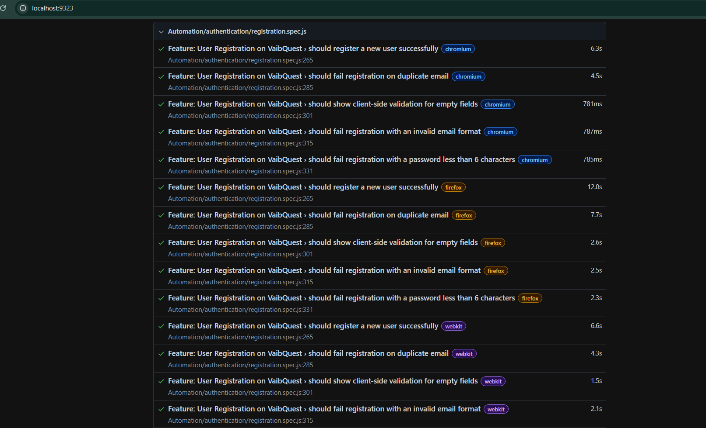
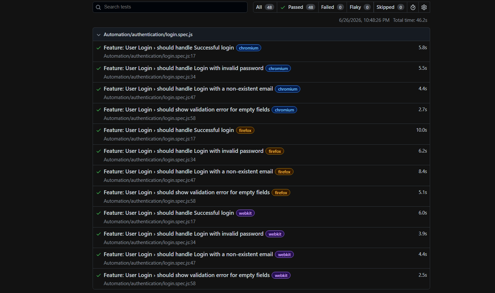
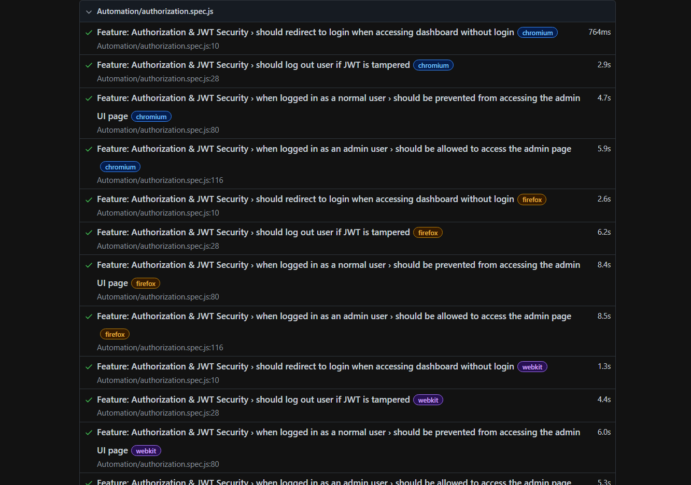

# Automation Test Suite: Setup & Execution Guide

This document provides a comprehensive overview of the target application, the testing environment, and the steps required to set up and execute the Playwright automation suite.

---

## 1. Application Overview: VaibQuest

The application under test is **VaibQuest**, a full-stack gamified learning platform.

- **Core Functionality:** It allows users to complete "quests," submit proof of completion, and earn experience points (XP) to climb a leaderboard. Administrators have a separate dashboard to create quests and evaluate user submissions.
- **Tech Stack:** The platform is built with a modern stack, including React.js (frontend), Node.js/Express.js (backend), and MongoDB (database).
- **Authentication:** The system uses a secure, JWT-based authentication mechanism with role-based access control (Admin/User).

---

## 2. Testing Environment & Strategy

- **Application URL:** All tests are executed against a live, deployed instance of the application available at: `https://vaibquest.netlify.app`.
- **Backend Services:** The backend is hosted on a free-tier cloud service. This can occasionally result in a slow initial server response ("cold start"). The test suite is designed to be resilient to this, with increased timeouts for initial API calls to ensure stability.
- **Testing Approach:** The suite follows a **black-box testing** methodology. It interacts with the live application's UI to validate end-to-end user flows, from registration and login to authorization checks. This ensures that tests verify the true, integrated user experience.

---

## 3. Setup and Execution Instructions

Follow these steps to set up the project and run the automated tests.

### Step 1: Initial Setup

1.  **Clone the Repository:**
    ```bash
    git clone <your-repository-url>
    cd <repository-folder>
    ```
2.  **Install Playwright:** If not already installed, initialize Playwright. This command also installs the necessary browser binaries.
    ```bash
    npm init playwright@latest
    ```
3.  **Install Dependencies:** The project requires the `dotenv` package to manage environment variables.
    ```bash
    npm install dotenv
    ```

### Step 2: Configure Test Data

1.  Create a file named `.env` in the root directory of the project.
2.  Add the following credentials for the test accounts. These are required for the login and authorization tests to pass.

    ```
    # Credentials for a standard user account
    TEST_EMAIL=testuser@example.com
    TEST_PASSWORD=Password123

    # Credentials for an administrator account
    ADMIN_EMAIL=admin@example.com
    ADMIN_PASSWORD=AdminPassword123
    ```

### Step 3: Run the Test Suite

1.  **Execute All Tests:** To run the entire suite across all configured browsers (Chromium, Firefox, WebKit) in headless mode, use the following command:
    ```bash
    npx playwright test
    ```
2.  **View the HTML Report:** After the test run is complete, Playwright will generate a detailed HTML report. You can open it using:
    ```bash
    npx playwright show-report
    ```

---

## 4. Test Execution Log

The following is the console output from running the full test suite.

```powershell
PS C:\Users\vaibh\OneDrive\Desktop\Playwright_Assignment> npx playwright test tests

Running 48 tests using 6 workers
  48 passed (46.2s)

To open last HTML report run:

  npx playwright show-report

PS C:\Users\vaibh\OneDrive\Desktop\Playwright_Assignment> npx playwright show-report

  Serving HTML report at http://localhost:9323. Press Ctrl+C to quit.
```

---

## 5. Test Reports

Screenshots of the HTML test reports for each feature.

### Registration Test Report



### Login Test Report



### Authorization Test Report



---

## Detailed Test Steps

The following images show the detailed steps executed within individual tests, providing a granular view of the test logic and assertions.

### Login Test Steps

This report details the sequence of actions for a successful user login, from filling credentials to verifying the dashboard redirection.


### JWT Tampering Test (Token Validation)

This report illustrates the security test case for validating JWT integrity. It shows the steps to log in, tamper with the token in local storage, and verify that the application forces a logout upon detecting the invalid token.


