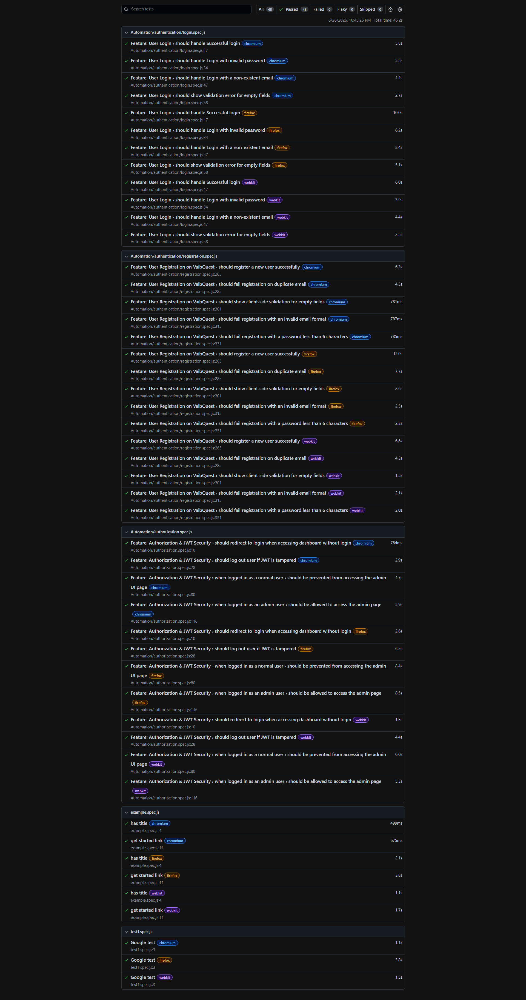
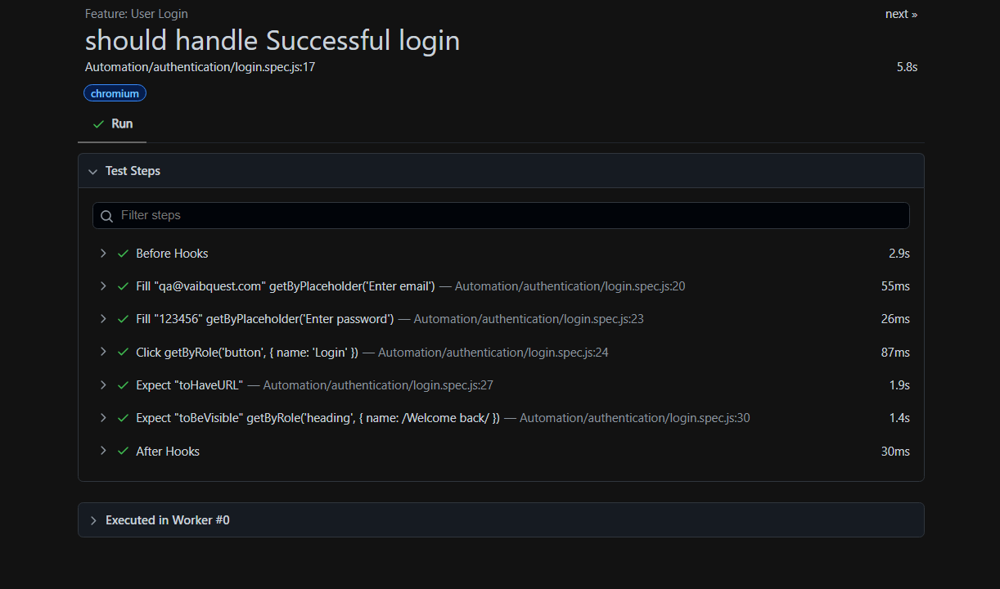
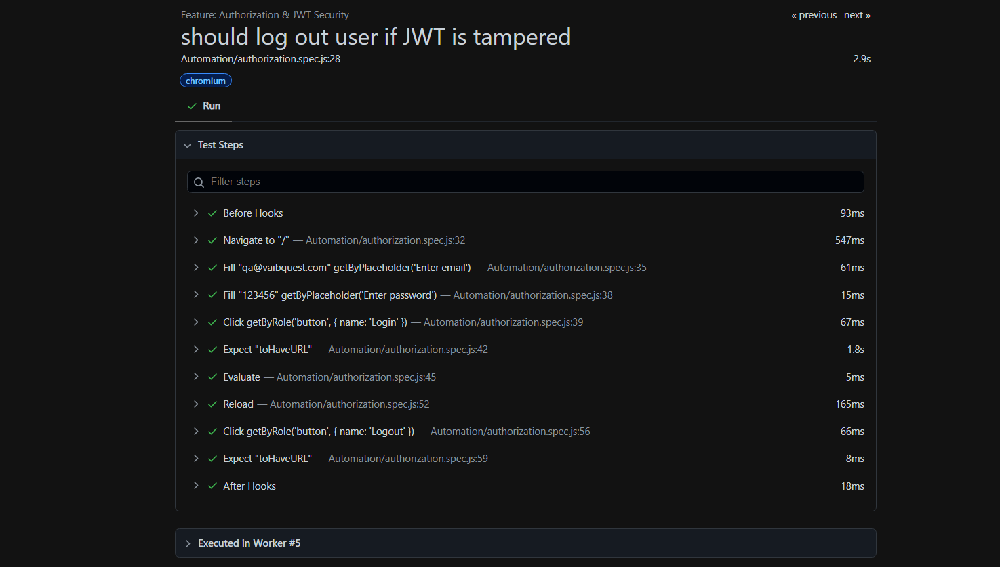

<div align="center">
  <h1>Playwright E2E Test Automation Suite</h1>
  <p>An end-to-end test automation suite for the VaibQuest application, focusing on authentication and authorization flows.</p>
  <p>
    
    
    
  </p>
</div>

This repository contains an end-to-end test automation suite for a user authentication and authorization system, built with Playwright. The suite is designed to validate the functionality of a live web application, covering registration, login, and JWT-based authorization flows.

---

## Application Under Test: VaibQuest

The application under test is **VaibQuest**, a full-stack gamified learning platform.

- **Core Functionality:** It allows users to complete "quests," submit proof of completion, and earn experience points (XP) to climb a leaderboard. Administrators have a separate dashboard to create quests and evaluate user submissions.
- **Tech Stack:** The platform is built with a modern stack, including React.js (frontend), Node.js/Express.js (backend), and MongoDB (database).
- **Authentication:** The system uses a secure, JWT-based authentication mechanism with role-based access control (Admin/User).
- **Source Code:** The source code for the application is available on GitHub: [**Vaibhav12113060/VaibQuest**](https://github.com/Vaibhav12113060/VaibQuest)

---

## Testing Environment & Strategy

- **Application URL:** All tests are executed against a live, deployed instance of the application available at: [**https://vaibquest.netlify.app**](https://vaibquest.netlify.app)
- **Backend Services:** The backend is hosted on a free-tier cloud service. This can occasionally result in a slow initial server response ("cold start"). The test suite is designed to be resilient to this, with increased timeouts for initial API calls to ensure stability.
- **Testing Approach:** The suite follows a **black-box testing** methodology. It interacts with the live application's UI to validate end-to-end user flows, from registration and login to authorization checks. This ensures that tests verify the true, integrated user experience.

---

## Project Structure

The project is organized to separate test code, documentation, and configuration, ensuring clarity and maintainability.

```
Playwright_Assignment/
├── Evidence/
│   ├── CompleteTestReport.png
│   ├── LoginTestSteps.png
│   ├── ValidateTokenSteps.png
│   └── setup-notes.md
├── node_modules/
├── tests/
│   ├── Automation/
│   │   ├── authentication/
│   │   │   ├── login.spec.js
│   │   │   └── registration.spec.js
│   │   └── authorization.spec.js
│   ├── example.spec.js
│   └── test1.spec.js
├── .env                # Stores confidential test data (e.g., user credentials)
├── .gitignore
├── Assumptions.md      # Documents assumptions made during test implementation
├── BoundaryCases.md    # Outlines boundary value analysis test cases
├── ManualTestCases.md  # Details the manual test case specifications
├── package-lock.json
├── package.json
├── playwright.config.js # Main configuration file for Playwright
└── README.md            # This file
```

### Key Directories & Files

- **`/tests/Automation/authentication/`**: Contains the core test scripts for `login`, `registration`, and `authorization` features.
- **`/Evidence/`**: Stores all project documentation and visual proof, including test reports and setup guides.
- **`ManualTestCases.md`**: Provides a detailed breakdown of the manual test cases that form the basis for the automation scripts.
- **`playwright.config.js`**: Configures browsers, test execution settings, and reporters.
- **`.env`**: A crucial file for storing environment-specific variables like test user credentials. It is excluded from version control for security.

---

## Test Suite Execution Report

The following screenshot provides a complete overview of the test suite execution, showing all 48 tests passing across three major browsers (Chromium, Firefox, and WebKit).

### Complete Test Run Summary



---

## Detailed Test Steps

The following images show the detailed steps executed within individual tests, providing a granular view of the test logic and assertions.

### Login Test Steps

This report details the sequence of actions for a successful user login, from filling credentials to verifying the dashboard redirection.



### JWT Tampering Test (Token Validation)

This report illustrates the security test case for validating JWT integrity. It shows the steps to log in, tamper with the token in local storage, and verify that the application forces a logout upon detecting the invalid token.


